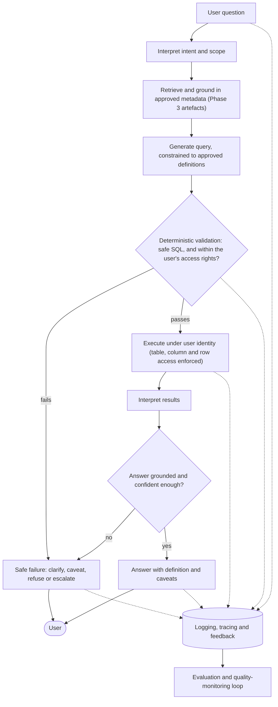

# Talk-to-Data: an enterprise delivery blueprint

> Talk-to-Data is not a chatbot connected to a database. It is a governed decision
> interface over trusted data — and the hard part was never making a model produce an
> answer. It is making sure every answer is grounded in the right definition, the right
> data, the right permissions and the right level of confidence — while staying useful
> enough to actually get adopted within its designed scope.

This repository is a practitioner's blueprint for delivering enterprise Talk-to-Data (T2D)
as a *governed analytics product*, paired with a reference implementation of the patterns it
describes.

The failure mode it is built to prevent is specific: a system that returns **fluent, plausible
and wrong** answers. In an enterprise context, this is not a minor limitation — it is a trust,
governance and adoption failure. Fluency is not evidence of correctness, and most of the delivery
work in T2D falls *around* the model, not in it.

The opposite failure matters just as much. A system so cautious that it refuses or caveats
everything is safe and useless, and it will not be adopted. The goal is a capability that stays
useful inside a *deliberately designed* scope — not one that maximises caution at the expense of
value, and not one that maximises coverage at the expense of trust.

## Contents

- [How a question becomes a governed answer](#how-a-question-becomes-a-governed-answer)
- [Implementation: proving the blueprint works](#implementation-proving-the-blueprint-works)
- [What "governed" means in practice](#what-governed-means-in-practice)
- [How to read this](#how-to-read-this)
- [The nine phases](#the-nine-phases)
- [Status](#status)
- [Repository](#repository)
- [Who wrote this](#who-wrote-this)
- [Scope and status](#scope-and-status)

## How a question becomes a governed answer



## Implementation: proving the blueprint works

The blueprint is not only prose. A working implementation lives in [`src/`](src/), built with
Python, FastAPI, Azure OpenAI, Azure SQL and Terraform.

**Data source.** The pipeline runs against real article data from Le Figaro scraped by
[lefigaro-harvester](https://github.com/danielBrule/lefigaro-harvester) — a companion project
(Python 3.13, Dockerised, Azure Container Instances, Azure Service Bus for async processing,
Key Vault for secrets, federated identity CI/CD). This is production scraped data, not synthetic
fixtures.

**What it demonstrates:**

- **Access-aware querying** — role-based view enforcement at execution time, not at the prompt level
- **Deterministic SQL validation** — AST-based (sqlglot) rejection of DDL, unscoped joins, missing
  row limits and forbidden views, before the query reaches the database
- **Metadata grounding** — SQL generated against approved metric definitions, grain contracts,
  mandatory filters and an approved join register, not inferred from user wording
- **Safe failure** — clarifying questions, data quality reports and refusals without touching SQL
  or the analytics database (short-circuit after intent stage)
- **Evaluation harness** — curated golden questions run through the live pipeline; pass rate, token
  usage and model names per stage logged to MLflow on every run
- **Answer verification** — spot checks on expected answers for curated questions are part of the
  pytest suite, validated against known outputs from the production dataset

**Deliberate scope decisions:**

- **Evaluation breadth** — questions are self-authored against a known dataset. No holdout set, no
  adversarial cases written by a second party. The pass rate measures pipeline stability; a
  production eval would extend to second-party questions and systematic ground-truth scoring.
- **Auth** — role is a plain HTTP header. Production requires Azure AD group membership mapped to
  allowed views, with row-level security enforced in SQL. The architecture is stateless so this is
  a bounded change to `auth.py`.
- **Scale** — five analytics views over one data source. Real view disambiguation — 50+ overlapping
  views, competing metric definitions, schema drift — is the problem this sidesteps.
- **Conversation window** — 3-turn sliding window, configurable via `MAX_HISTORY_TURNS`. Set to 3
  for cost control on a self-funded build; production would extend this based on observed user
  session length.
- **Monitoring** — traces and feedback are collected (SQLite locally, Azure SQL in production) but
  there is no operational dashboard yet. The data model supports it: refusal rate, token cost per
  question, failure category distribution and session volume are all queryable from the existing
  schema.

The blueprint documents what closing each gap requires in a full delivery.

## What "governed" means in practice

Every metric the system can answer is defined once — with its calculation, grain, mandatory
filters, access rules and caveats — and the model queries *that definition* rather than
reconstructing one:

| Field | Example |
|---|---|
| Metric | Net revenue |
| Definition | Revenue after discounts, credits and refunds |
| Calculation | `SUM(gross_revenue - discount_amount - refund_amount)` |
| Grain | Order line |
| Mandatory filters | Completed orders only; test orders excluded |
| Access | Restricted by region and legal entity |
| Caveat | Current month provisional; refunds may lag up to 48h |

A user asking *"net revenue last month by region"* gets the approved definition, their permitted
regions only, and the provisional-month caveat — or a refusal if the question falls outside
approved scope. That control surface, not the language model, is the product.

## How to read this

| You have | Read | You'll get |
|---|---|---|
| 3 minutes | this README | the thesis and the shape of the work |
| 15 minutes | [`docs/master.md`](docs/master.md) | delivery logic, risks, decision gates, operating model |
| Going deep | [`docs/phases/`](docs/phases) | the nine-phase delivery journey, end to end |
| Building one | [`docs/annexes/`](docs/annexes) | templates, scorecards, registers, worked examples to adapt |

Prefer a formatted document? PDF versions of every document are in [`docs/pdf/`](docs/pdf/).

The phase model is delivery *logic*, not a fixed waterfall — phases run light for a POC, deepen for
an MVP, and formalise before pilot or production. The discipline is to avoid carrying POC
assumptions into production without revalidating them.

## The nine phases

| Phase | Focus | What it decides |
|---|---|---|
| 1 | [Framing](docs/phases/phase_1_framing.md) | Is T2D the right response to a real business need, and is it bounded and owned? |
| 2 | [Data & semantic readiness](docs/phases/phase_2_data_semantic_readiness.md) | Which questions can be answered safely, and which need remediation, caveats or deferral? |
| 3 | [Governed data foundation](docs/phases/phase_3_governed_data_foundation.md) | The approved queryable layer: metric logic, joins, filters, access controls, caveats, quality checks |
| 4 | [Design architecture](docs/phases/phase_4_design_architecture.md) | How a question becomes a governed answer: grounding, model use, tool boundaries, validation, safe failure |
| 5 | [Prototype / MVP build](docs/phases/phase_5_prototype_mvp_build.md) | A bounded, observable, testable build that generates evidence before formal validation |
| 6 | [Validation, assurance & remediation](docs/phases/phase_6_validation_assurance_remediation.md) | Is it safe, reliable and evidenced enough for controlled user testing? |
| 7 | [Controlled pilot & user testing](docs/phases/phase_7_controlled_pilot.md) | Does it hold up with real users, real questions and real operating conditions? |
| 8 | [Production readiness & release](docs/phases/phase_8_production_readiness.md) | Resilience, support, monitoring, access, governance, ownership — and the release decision |
| 9 | [Operate, adopt & improve](docs/phases/phase_9_operate_adopt_improve.md) | Run it as a live product: feedback, regression testing, cost control, semantic updates |

Each phase has a main guide (delivery logic, decisions, risks, required outputs, handover) and an
annex pack (practical material to adapt, not follow mechanically).

## Status

- **Blueprint (all nine phases + annexes):** published.
- **Reference implementation:** in active development; will be published in this repository.

## Repository

```text
README.md              This file — the pitch and a map of the repo
Makefile               Task runner (install, eval, mlflow-ui, tests, infra-*)
docs/                  The blueprint — see docs/README.md
  master.md            Strategic overview: logic, risks, gates, operating model
  phases/              The nine phase guides
  annexes/             Templates, checklists, registers, worked examples
  pdf/                 Formatted PDF versions of every document
src/                   Reference implementation — see src/README.md
  Dockerfile           Container image (build context: repo root)
  docker-compose.yml   Local container stack
  mlflow.db            MLflow experiment metadata (SQLite) — committed so the UI works on clone
  mlruns/              MLflow artifact store — committed alongside mlflow.db
                       (run `make mlflow-ui` to browse results at http://localhost:5000)
  evaluation_results/  Golden evaluation JSON reports, one file per run (git commit hash embedded)
  backend/             FastAPI pipeline, stages, prompts, evaluation runner, tests
  frontend/            React + Vite chat UI
  metadata/            View schemas, metrics, glossary, golden questions
  sql/                 View DDL and security scripts
  infra/               Terraform modules for Azure deployment
```

> **Why `mlflow.db` and `mlruns/` are committed.** Committing them means `make mlflow-ui` works
> immediately after `git clone` with no re-run required. Both are small (SQLite DB ~100 KB,
> artifacts ~6 KB per run). The correct long-term home is a remote tracking server (Azure ML
> has native MLflow support); SQLite local tracking is a pragmatic choice for a
> single-developer demo project.

- **The blueprint** lives in [`docs/`](docs/) — start with [`docs/README.md`](docs/README.md).
- **The implementation** lives in [`src/`](src/) — see [`src/README.md`](src/README.md).
- **Regenerate the PDFs** after editing any Markdown with `make pdf` (see the Makefile).

## Who wrote this

I'm **Daniel Brule** — a data and AI delivery leader based in London, with around 15 years across
the field: first as a software engineer (Thomson Reuters, Criteo), then leading customer-facing
data and AI delivery in consulting (PwC, AlixPartners, Ekimetrics) across private equity, financial
services and regulated environments, and now building governed GenAI systems hands-on.

This blueprint distils that delivery experience and applies it to what I am currently learning
building Talk-to-Data systems. The judgment and the practitioner notes throughout are mine, drawn
from 15 years of getting data and analytics into production and adopted. The drafting was
AI-assisted — deliberately, because it is the same AI-assisted delivery workflow the blueprint
advocates.

Feedback and disagreement are welcome. LinkedIn: <https://www.linkedin.com/in/danielbrule/>

## Scope and status

This is a delivery blueprint, not a technical design, security policy, compliance review or vendor
selection framework. Cost, effort and timeline figures are illustrative planning aids, not
benchmarks. Security, privacy and regulatory requirements should be reviewed by the appropriate
specialists for each organisation.

<!-- TODO: add a LICENSE file and reference it here, e.g. "Licensed under CC BY 4.0." -->
