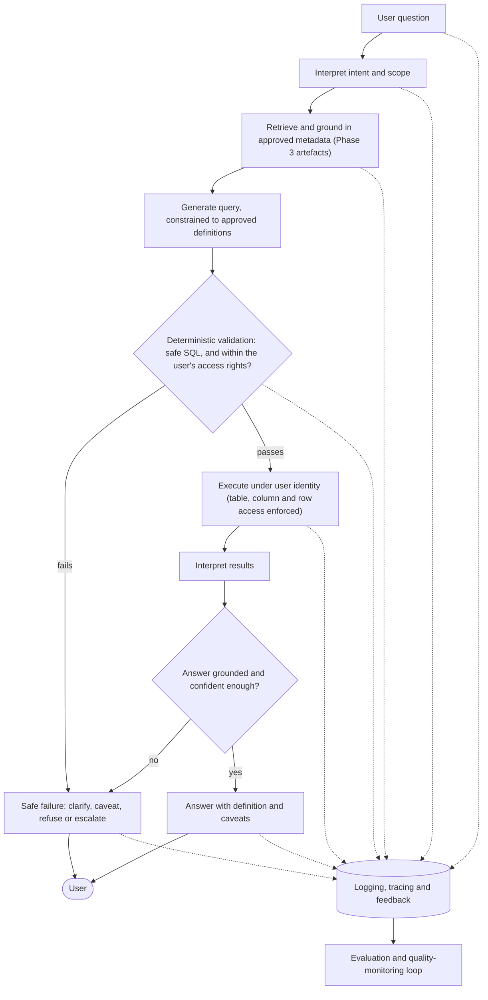

# Talk-to-Data: an enterprise delivery blueprint

> Talk-to-Data is not a chatbot connected to a database. It is a governed decision
> interface over trusted data — and the hard part was never making a model produce an
> answer. It is making sure every answer is grounded in the right definition, the right
> data, the right permissions and the right level of confidence — while staying useful
> enough to actually get adopted within its designed scope.

This repository is a practitioner's blueprint for delivering enterprise Talk-to-Data (T2D)
as a *governed analytics product*, paired with a reference implementation of the patterns it
describes.

The failure mode it is built to prevent is specific: a system that returns **fluent, plausible
and wrong** answers. In an enterprise context that is not a minor limitation — it is a trust,
governance and adoption failure. Fluency is not evidence of correctness, and most of the delivery
work in T2D sits *around* the model, not in it.

The opposite failure matters just as much. A system so cautious that it refuses or caveats
everything is safe and useless, and it will not be adopted. The goal is a capability that stays
useful inside a *deliberately designed* scope — not one that maximises caution at the expense of
value, and not one that maximises coverage at the expense of trust.

## How a question becomes a governed answer



## The reference implementation (in active development)

The blueprint is not only prose. A reference implementation is being built to demonstrate the
patterns the documents argue for, using OpenAI, Python, SQL, Azure, Terraform and Docker. It will
be published in this repository. What it sets out to demonstrate:

- **Access-aware querying** — results are filtered to the tables, columns and rows each user is
  permitted to see, enforced in the query and execution path, not requested in the prompt.
- **Deterministic query validation** — writes, drops, unrestricted joins, missing row limits and
  forbidden tables are blocked *before* execution, not reviewed after.
- **Metadata grounding** — queries are constrained to approved metric definitions, rather than
  inferred from the user's wording.
- **Safe failure** — the system clarifies, caveats, refuses or escalates instead of guessing.
- **Evaluation harness** — roughly 70 golden questions, with expected answers and safe-failure
  cases, across ~20 tables and ~30 governed views.

When the code is public, each claim above will map to where it is implemented, so the blueprint and
the build can be checked against each other.

## What "governed" means in practice

Every metric the system can answer is defined once — with its calculation, grain, mandatory
filters, access rules and caveats — and the model queries *that definition* rather than
reconstructing one:

| Field | Example |
|---|---|
| Metric | Net revenue |
| Definition | Revenue after discounts, credits and refunds |
| Calculation | `SUM(gross_revenue - discount_amount - refund_amount)` |
| Grain | Order line |
| Mandatory filters | Completed orders only; test orders excluded |
| Access | Restricted by region and legal entity |
| Caveat | Current month provisional; refunds may lag up to 48h |

A user asking *"net revenue last month by region"* gets the approved definition, their permitted
regions only, and the provisional-month caveat — or a refusal if the question falls outside
approved scope. That control surface, not the language model, is the product.

## How to read this

| You have | Read | You'll get |
|---|---|---|
| 3 minutes | this README | the thesis and the shape of the work |
| 15 minutes | [`docs/master.md`](docs/master.md) | delivery logic, risks, decision gates, operating model |
| Going deep | [`docs/phases/`](docs/phases) | the nine-phase delivery journey, end to end |
| Building one | [`docs/annexes/`](docs/annexes) | templates, scorecards, registers, worked examples to adapt |

Prefer a formatted document? PDF versions of every document are in [`docs/pdf/`](docs/pdf/).

The phase model is delivery *logic*, not a fixed waterfall — phases run light for a POC, deepen for
an MVP, and formalise before pilot or production. The discipline is to avoid carrying POC
assumptions into production without revalidating them.

## The nine phases

| Phase | Focus | What it decides |
|---|---|---|
| 1 | [Framing](docs/phases/phase_1_framing.md) | Is T2D the right response to a real business need, and is it bounded and owned? |
| 2 | [Data & semantic readiness](docs/phases/phase_2_data_semantic_readiness.md) | Which questions can be answered safely, and which need remediation, caveats or deferral? |
| 3 | [Governed data foundation](docs/phases/phase_3_governed_data_foundation.md) | The approved queryable layer: metric logic, joins, filters, access controls, caveats, quality checks |
| 4 | [Design architecture](docs/phases/phase_4_design_architecture.md) | How a question becomes a governed answer: grounding, model use, tool boundaries, validation, safe failure |
| 5 | [Prototype / MVP build](docs/phases/phase_5_prototype_mvp_build.md) | A bounded, observable, testable build that generates evidence before formal validation |
| 6 | [Validation, assurance & remediation](docs/phases/phase_6_validation_assurance_remediation.md) | Is it safe, reliable and evidenced enough for controlled user testing? |
| 7 | [Controlled pilot & user testing](docs/phases/phase_7_controlled_pilot.md) | Does it hold up with real users, real questions and real operating conditions? |
| 8 | [Production readiness & release](docs/phases/phase_8_production_readiness.md) | Resilience, support, monitoring, access, governance, ownership — and the release decision |
| 9 | [Operate, adopt & improve](docs/phases/phase_9_operate_adopt_improve.md) | Run it as a live product: feedback, regression testing, cost control, semantic updates |

Each phase has a main guide (delivery logic, decisions, risks, required outputs, handover) and an
annex pack (practical material to adapt, not follow mechanically).

## Status

- **Blueprint (all nine phases + annexes):** published.
- **Reference implementation:** in active development; will be published in this repository.

## Repository structure

```text
docs/
  master.md            Strategic overview: logic, risks, gates, operating model
  phases/              The nine phase guides
  annexes/             Templates, checklists, registers, worked examples
  pdf/                 Formatted PDF versions of every document
```

## Who wrote this

I'm **Daniel Brule** — a data and AI delivery leader based in London, with around 15 years across
the field: first as a software engineer (Thomson Reuters, Criteo), then leading customer-facing
data and AI delivery in consulting (PwC, AlixPartners, Ekimetrics) across private equity, financial
services and regulated environments, and now building governed GenAI systems hands-on.

This blueprint distils that delivery experience and applies it to what I am currently learning
building Talk-to-Data systems. The judgment and the practitioner notes throughout are mine, drawn
from 15 years of getting data and analytics into production and adopted. The drafting was
AI-assisted — deliberately, because it is the same AI-assisted delivery workflow the blueprint
advocates.

Feedback and disagreement are welcome. LinkedIn: <https://www.linkedin.com/in/danielbrule/>

## Scope and status

This is a delivery blueprint, not a technical design, security policy, compliance review or vendor
selection framework. Cost, effort and timeline figures are illustrative planning aids, not
benchmarks. Security, privacy and regulatory requirements should be reviewed by the appropriate
specialists for each organisation.


